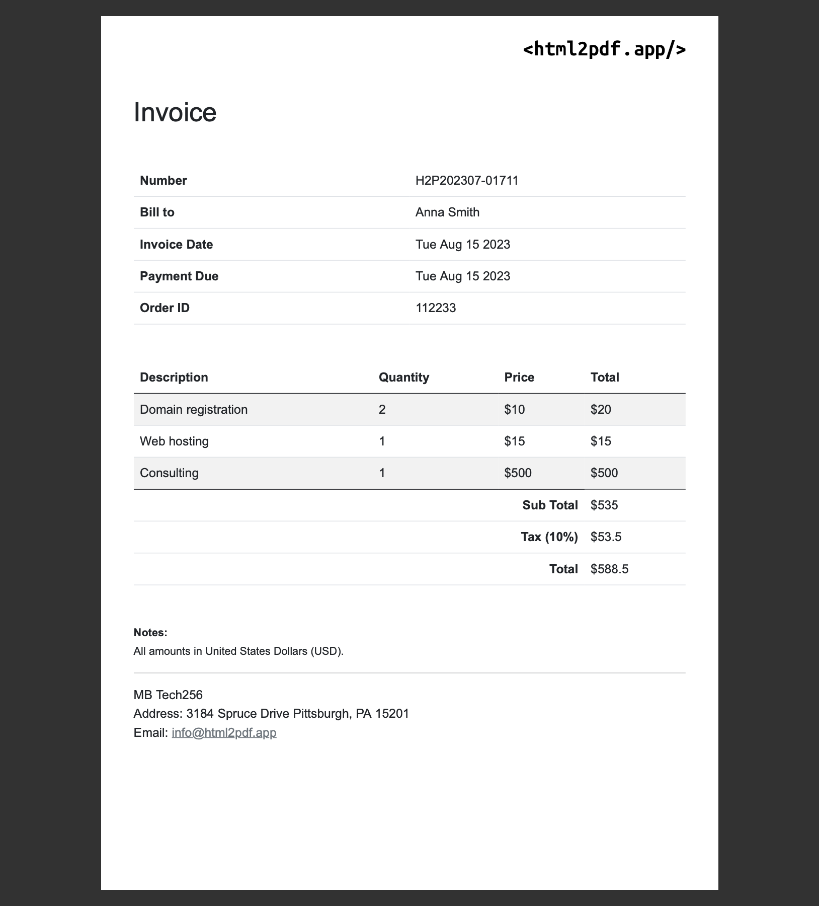

## Examples of using html2pdf.app

### Generate invoice PDF file from the HTML template

This example shows how to generate a simple invoice PDF file from the HTML template using [html2pdf.app](https://html2pdf.app) API and NodeJS.

To separate code from the presentation we will use a template engine [Handlebars](https://handlebarsjs.com/).

The conversion result would look like fallowing:

#### Steps
1. Register https://html2pdf.app/ and get a free api key.
2. Set the `apiKey` value in the `./src/generate-invoice.js`.
3. Run `npm install`.
4. Execute the script `node ./src/generate-invoice.js`.
5. Check the generated result `./assets/invoice.pdf`.

For more details check the conversion script `./src/generate-invoice.js`.
